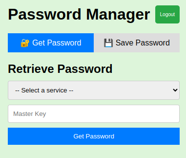
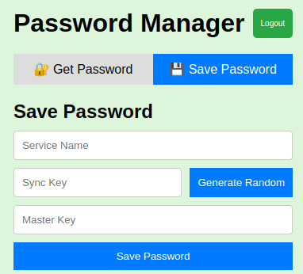

# 🔐 VaultSync (Frontend)

This is the **frontend application** for VaultSync — a secure and minimal vault manager built with **Vite + React**. It allows users to authenticate, store, retrieve, and manage encrypted credentials securely.

> ⚠️ This project is built for **educational and personal use only**.

---

## 🚀 Features

- ✅ User login via email/password or Google Sign-In
- 🔐 Secure credential syncing via backend APIs
- 📱 Fully responsive UI
- 🌐 PWA-enabled (installable and works offline)
- 📊 Integrated with Vercel Analytics

---

## 🧱 Tech Stack

| Layer         | Tech                |
|---------------|---------------------|
| Frontend      | React + Vite        |
| State         | React Hooks         |
| Auth          | Firebase Auth       |
| API Calls     | REST (Firebase Functions) |
| Hosting       | Vercel              |
| PWA           | vite-plugin-pwa     |

---

## 🛠️ Getting Started

### 1️⃣ Install Dependencies
```bash
npm install
```

### 2️⃣ Run in Development
```bash
npm run dev
```

### 3️⃣ Build for Production
```bash
npm run build
```

---

## 🔐 Environment Variables

Create a `.env` file in the root of the `web/` directory with:

```env
VITE_API_BASE_URL=https://your-backend-api-url
VITE_FIREBASE_API_KEY=your-firebase-api-key
VITE_FIREBASE_AUTH_DOMAIN=your-app.firebaseapp.com
VITE_FIREBASE_PROJECT_ID=your-firebase-project-id
```

> Do **not** commit this file. It should be ignored via `.gitignore`.

---

## 🌐 Deployment (Vercel)

1. Push this folder to a GitHub repo
2. Import the repo on [vercel.com](https://vercel.com)
3. Set build settings:
   - **Build command**: `npm run build`
   - **Output directory**: `dist`
4. Add environment variables via **Vercel Project → Settings → Environment Variables**
5. Deploy! ✅

---

## 📸 Screenshots





---

## 📜 License

MIT — free to use and adapt.

---

## 🧑‍💻 Author

**Abhishek Kumar**  
GitHub: [@Abhi2061-Github](https://github.com/Abhi2061)
LinkedIn: [@Abhishek-LinkedIn] (https://www.linkedin.com/in/abhishek-kumar-cu/)